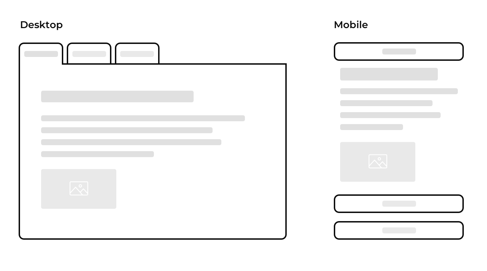

**Project to be moved to GitHub**

| Maintained by   |
|-----------------|
| Jamie Halvorson |

Declaritive, accessible tabs in React that collapse into accordions on mobile.

This component uses the Context API, therefore there is a minimum requirement of **React 16.3**.

## Example



## Usage

```javascript
export default function myComponent() {
  return (
    <Tabs>
      <Tab title="Tab One">
        <h1>Ain't this tidy?</h1>
        <p>I'm more text</p>
      </Tab>
      <Tab>
        <SomeOtherComponent  />
      </Tab>
    <Tabs>
  );
}
```

## API
There are a number of options available for targeting styles and providing data to the components.

| Prop | Component | Description |
|------|-----------|-------------|
| `className` | `<Tabs>` | |
| `contentClassName` | `<Tabs>` | |
| `className` | `<Tab>` | |
| `activeClassName` | `<Tab>` | |
| `title` | `<Tab>` | |
| `toggleClassName` | `<Tabs>` | |

## Development

We use storybook for component development, to get up and running follow these steps:

1. Clone the repository, `cd` into the root and run `npm install`
2. Open two terminal windows, in the first window:
3. cd into the root of the project run `npm run dev`, this will start webpack
4. In the second window, `cd` into the project and run `npm run storybook`


## Contributing

Please see the [contrubting guidlines](CONTRIBUTING.md).
