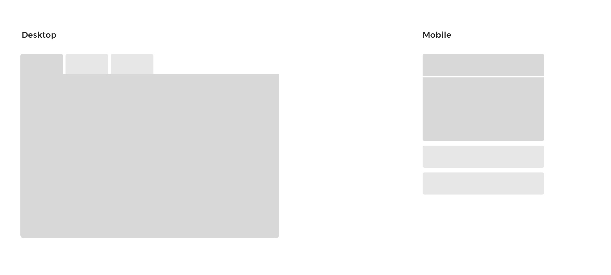

**Project to be moved to GitHub**

| Maintained by |
|---------------|
| Jamie Halvorson |

Declaritive, accessible tabs in React that collapse into accordions on mobile.

## Example



### Usage

```javascript
export default function myComponent() {
  return (
    <Tabs>
      <Tab title="Tab One">
        <h1>Ain't this tidy?</h1>
        <p>I'm more text</p>
      </Tab>
      <Tab>
        <SomeOtherComponent  />
      </Tab>
    <Tabs>
  );
}
```

## Development

All development happens in Storybook.


## Contributing

Please see the [contrubting guidlines](CONTRIBUTING.md).
